# dynamic-plugin-framework

> Dynamic plugin framework for Bun based on Javascript Modules and import()
> function

[//]: # (TODO: Remove this when plugin indexing and discovery available.)

**STILL IN DEVELOPMENT**

## Overview

This project provides a framework for defining plugins which can be dynamically
discovered and imported into a running process.

#### Key Features

- Universal support for both Bun and browser runtimes
- Dynamic plugin import using
  [Javascript dynamic import](https://developer.mozilla.org/en-US/docs/Web/JavaScript/Reference/Operators/import)
- ES2015 module based
- Written in Typescript

#### Key Concepts

The framework's key concepts are borrowed from the Eclipse Project's extension
framework. The key concepts are:

- A `Plugin` provides one or more `Extension` implementations.
- Each `Extension` implementation declares an `ExtensionPoint` identifier and an
  `ExtensionFactory` via an `ExtensionDescriptor`.
- A `HostApplication` instantiates a `PluginManager`.
- The `HostApplication` can register one or more `ExtensionPoint` identifiers
  that the `PluginManager` should be aware of.
- The `PluginManager` scans one or more `PluginRepository` implementations to
  find and register `Plugin` objects for any `ExtensionPoint` identifiers it is
  aware of.
- The `HostApplication` uses the `PluginManager` to query for and select an
  `Extension` for a desired `ExtensionPoint` identifier.
- The `PluginManager` uses the associated `ExtensionFactory` to instantiate the
  selected `Extension`.

The following high level class diagram illustrates these relationships:

```mermaid
classDiagram
    direction LR

    class HostApplication {
    }

    class ExtensionPoint1 {
        <<interface>>
        EXTENSION_POINT_1
    }

    class Plugin {
        <<interface>>
    }

    class PluginManager {
        <<interface>>
    }

    class PluginRepository {
        <<interface>>
    }

    class ExtensionDescriptor {
        <<interface>>
    }

    class ExtensionFactory {
        <<interface>>
    }

    class Plugin1 {
    }

    class Extension1Descriptor {
    }

    class Extension1Factory {
    }

    class Extension1 {
    }

    PluginRepository --> "0..*" Plugin
    PluginManager -->  "1..*" PluginRepository: scans
    Plugin --> "1..*" ExtensionDescriptor
    ExtensionDescriptor --> ExtensionFactory
    PluginManager --> "0..*" Plugin : registers
    PluginManager ..> ExtensionFactory : invokes
    Extension1Factory ..|> ExtensionFactory
    Extension1Descriptor ..|> ExtensionDescriptor
    Plugin1 ..|> Plugin
    Extension1 ..|> ExtensionPoint1
    Plugin1 --> Extension1Descriptor
    Extension1Descriptor --> Extension1Factory
    Extension1Factory ..> Extension1 : creates
    Extension1Descriptor ..> ExtensionPoint1: declares
    HostApplication --> PluginManager
    HostApplication ..> ExtensionPoint1: defines
```

The following sequence diagram illustrates the key steps for a `HostApplication`
to use a `PluginManager` for discovery and registration of `Plugin` instances:

Once registration has been performed, the `HostApplication` may query the
`PluginManager` for `Extensions` of known `ExtensionPoints` and then instantiate
them:

As `ExtensionPoints` are simply Typescript objects, for the purposes of testing
or validation, it is possible to bypass the framework altogether and import an
`Extension` and use it directly:

## Examples

The following example projects are available which support execution in both a
terminal and a browser:

- [Plugin](https://github.com/flowscripter/example-plugin)
- [Host Application](https://github.com/flowscripter/example-host-application)
- [Host Webapp](https://github.com/flowscripter/example-host-webapp)

## API

The following diagram provides an overview of the `Plugin` API:

The following diagram provides an overview of the `PluginManager` API:

API docs for the library:

[API Documentation](https://flowscripter.github.io/dynamic-plugin-framework/index.html)

## Development

Install dependencies:

`bun install`

Test:

`bun test`

**NOTE**: The following tasks use Deno as it excels at these and Bun does not
currently provide such functionality:

Format:

`deno fmt`

Lint:

`deno lint index.ts src/ tests/`

Generate HTML API Documentation:

`deno doc --html --name=dynamic-plugin-framework index.ts`

The following diagram provides an overview of the main internal classes:

## License

MIT © Flowscripter
