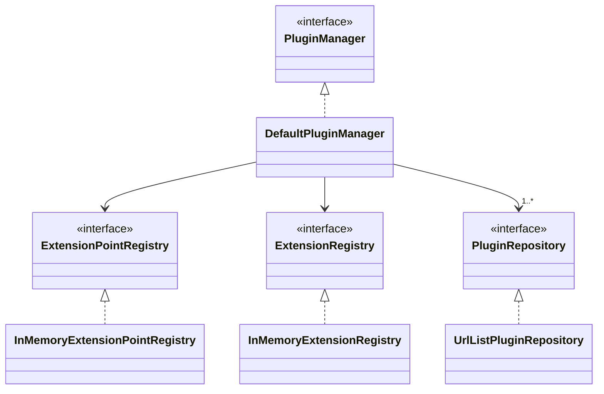

# Development

Install dependencies:

`bun install`

Test:

`bun test`

Format:

`bunx oxfmt`

Lint:

`bunx oxlint index.ts plugin.ts src/ tests/`

Generate HTML API Documentation:

`bunx typedoc index.ts`

The following diagram provides an overview of the main internal classes:

