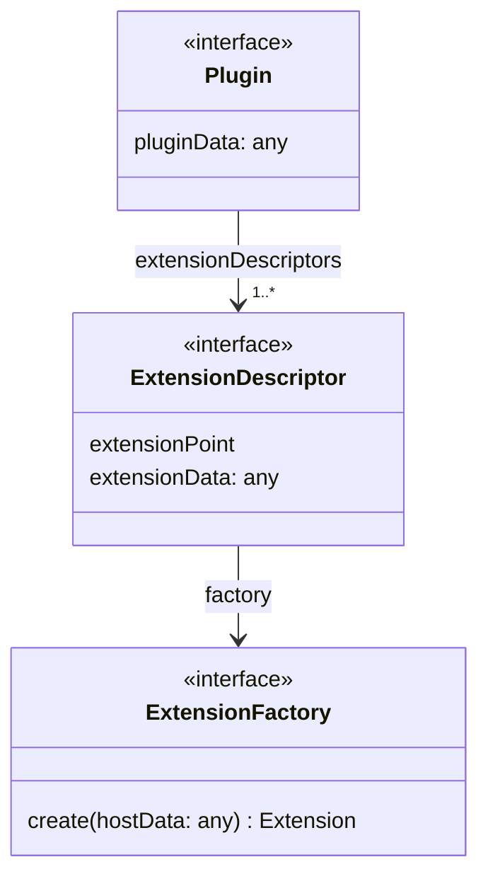
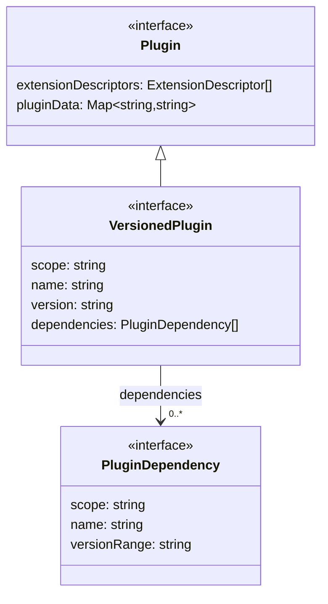
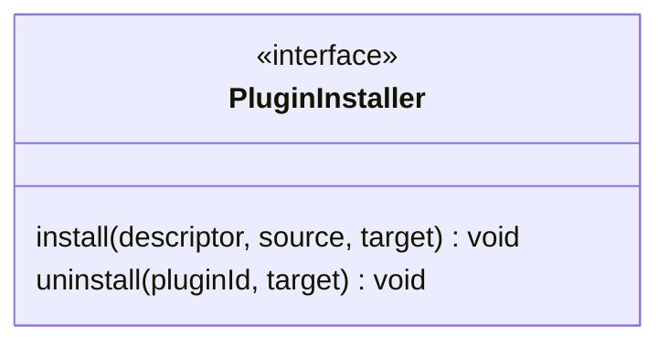
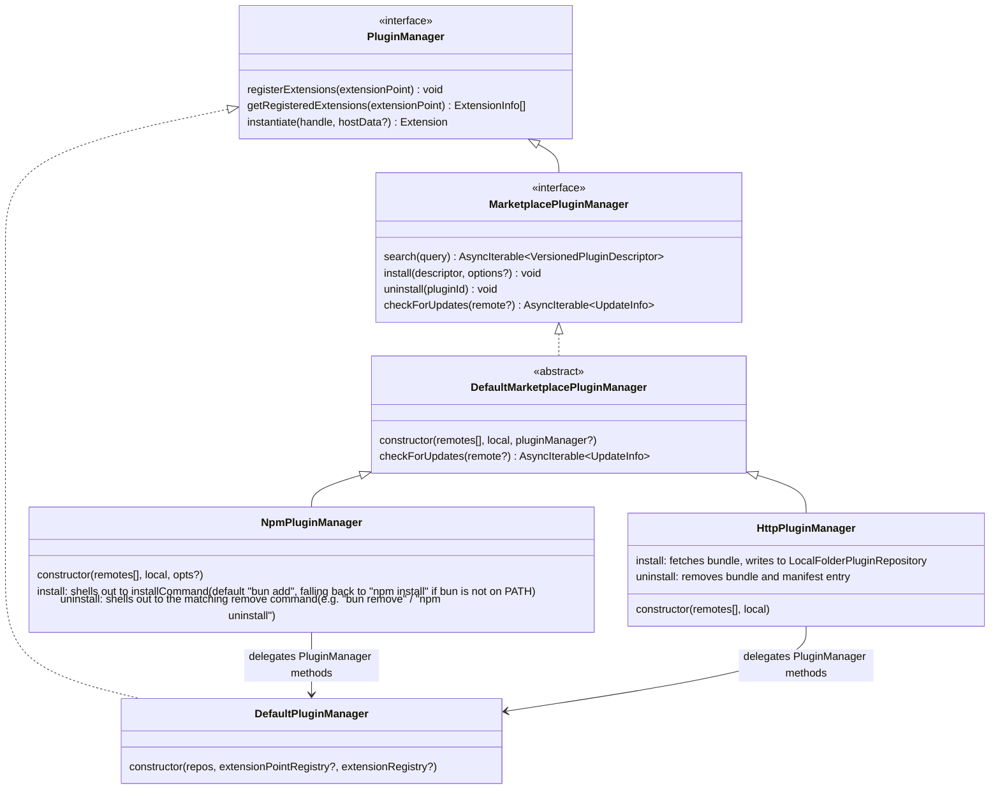
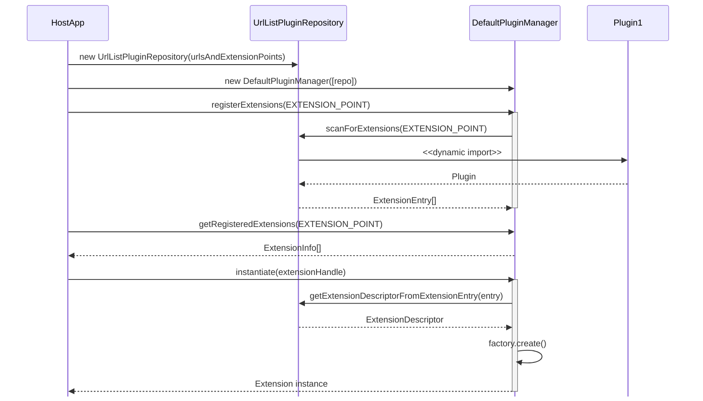
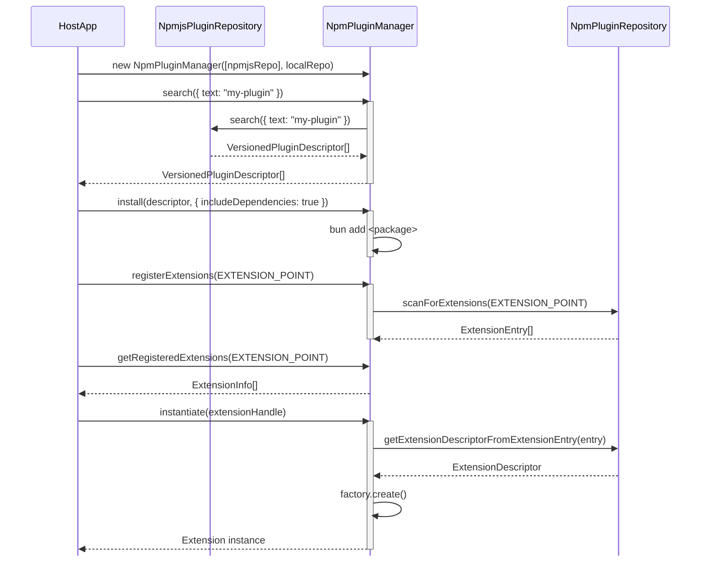

# Implementation Details

The package provides two entry points depending on your role:

**Plugin authors** only need the plugin-side interfaces. Import from the
`/plugin` subpath to keep the host implementation out of your module graph. For example:

```typescript
import type {
  Plugin,
  ExtensionDescriptor,
  ExtensionFactory,
  PluginDependency,
  VersionedPlugin,
} from "@flowscripter/dynamic-plugin-framework/plugin";
```

When building a plugin that will be consumed via `node_modules` (i.e.
installed as a dependency by a host application), don't bundle at all -
transpile with `tsc` instead:

```json
{
  "compilerOptions": {
    "outDir": "dist",
    "rootDir": ".",
    "declaration": true,
    "rewriteRelativeImportExtensions": true
  },
  "include": ["index.ts", "src/**/*.ts"]
}
```

This mirrors your source tree into `dist/`, rewrites relative `.ts` imports
to `.js`, and leaves bare specifiers (e.g.
`@flowscripter/dynamic-plugin-framework`, or
`@flowscripter/dynamic-cli-framework` for CLI plugins) completely untouched
so they resolve via `node_modules` at runtime. There's nothing to
externalize because nothing gets bundled: mark host-supplied packages as
`peerDependencies` in your `package.json` (this documents "the host
application is expected to have a compatible version installed") and let
regular `dependencies` (e.g. a helper library your plugin actually ships
with) resolve from `node_modules` the same way.

The one exception is a plugin meant to be a fully self-contained
distributable loaded via URL/CDN rather than `node_modules` (e.g.
`UrlListPluginRepository` fetches the bundle and dynamically imports it from
a local cache path outside any `node_modules` tree) - in that case full
bundling (e.g. `bun build`) is required, since there is no `node_modules` to
resolve an unbundled or externalized import against at that cache path. If a
host-supplied package is only ever referenced via `import type` (fully erased
at compile time, so nothing is emitted to bundle in the first place), it can
still be marked `--external` and `peerDependency` as a guardrail so a future
accidental value import fails loudly instead of silently duplicating the
host's runtime code into the bundle. Any package with a real value import
must stay bundled.

**Host application authors** import from the main entry point, which exposes
the full API including concrete implementations. For example:

```typescript
import {
  DefaultPluginManager,
  NpmjsPluginRepository,
  NpmPluginRepository,
  NpmPluginManager,
} from "@flowscripter/dynamic-plugin-framework";
import type { ExtensionInfo, PluginManager } from "@flowscripter/dynamic-plugin-framework";
```

## Plugin API

The following diagram provides an overview of the `Plugin` API:



A `VersionedPlugin` extends `Plugin` with metadata that can be used by versioned repositories and installers without loading the plugin module:



## PluginRepository API

The framework provides a hierarchy of `PluginRepository` interfaces. The base interface is extended by `VersionedPluginRepository` (for repos with version metadata in a backing store) and further by `MarketplacePluginRepository` (for remote marketplaces):


## PluginInstaller API

`PluginInstaller` provides the base install/uninstall contract for transferring plugins between repositories:



## PluginManager API

`DefaultPluginManager` handles standard plugin discovery and instantiation. `MarketplacePluginManager` extends the `PluginManager` API with search, install, uninstall, and update checking, delegating standard manager methods to an internal `DefaultPluginManager` backed by the local repository:



## Plugin Discovery and Instantiation Flow

The following sequence diagram shows the flow for using `DefaultPluginManager` directly with a `UrlListPluginRepository`:



## Marketplace Plugin Discovery, Installation and Instantiation Flow

The following sequence diagram shows the flow for using `NpmPluginManager` to search, install, and instantiate plugins from the npm marketplace:


