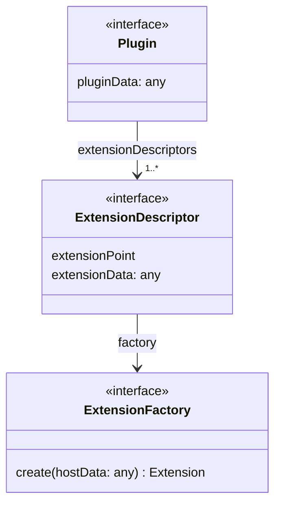
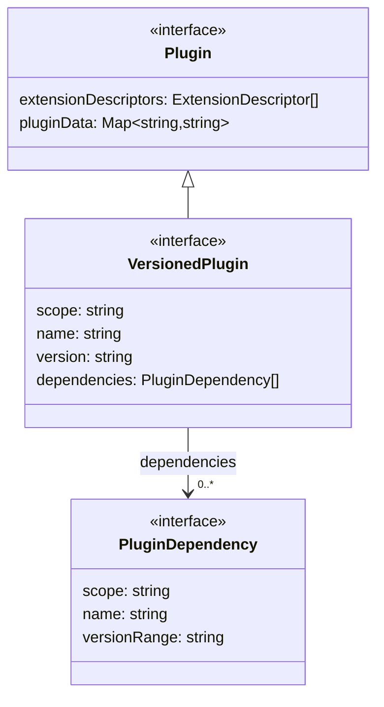
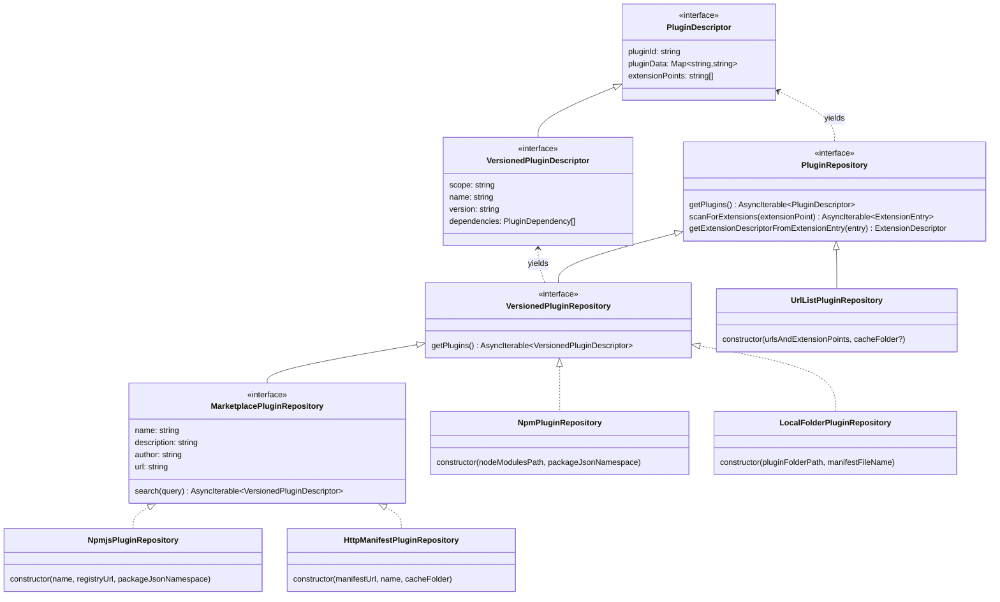
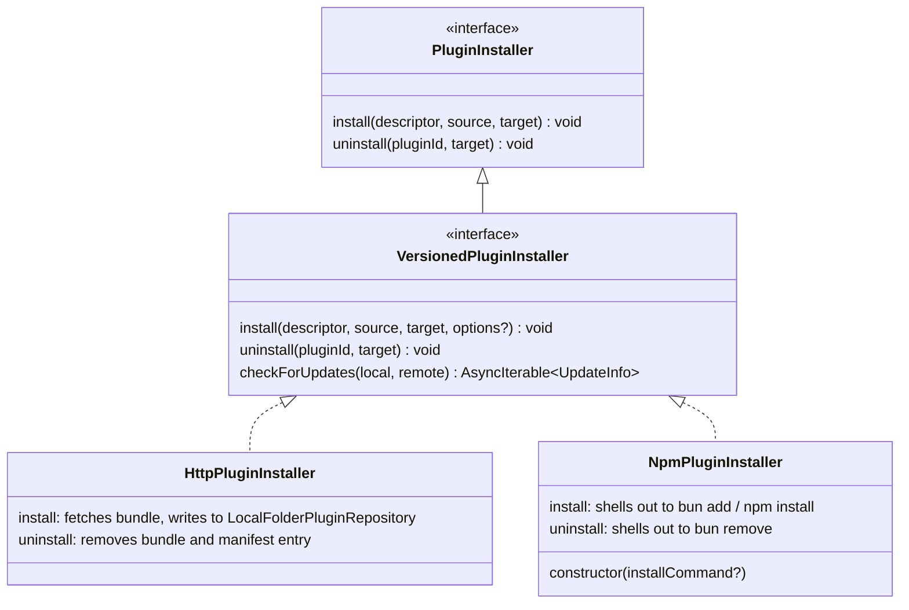
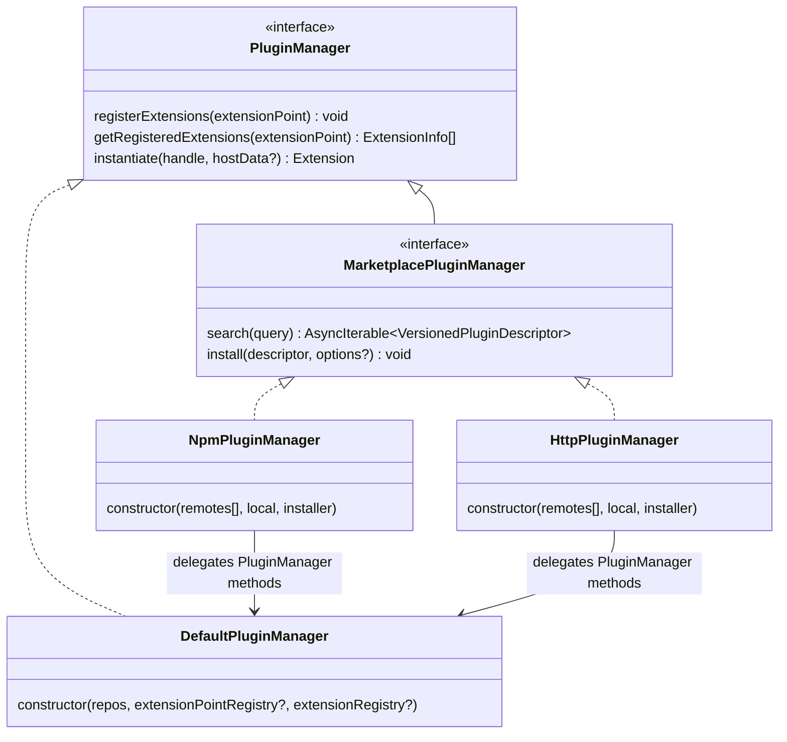
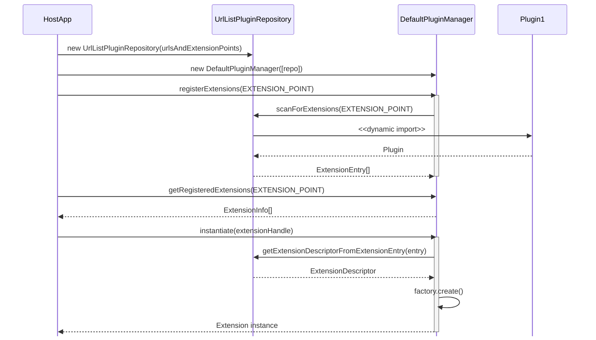
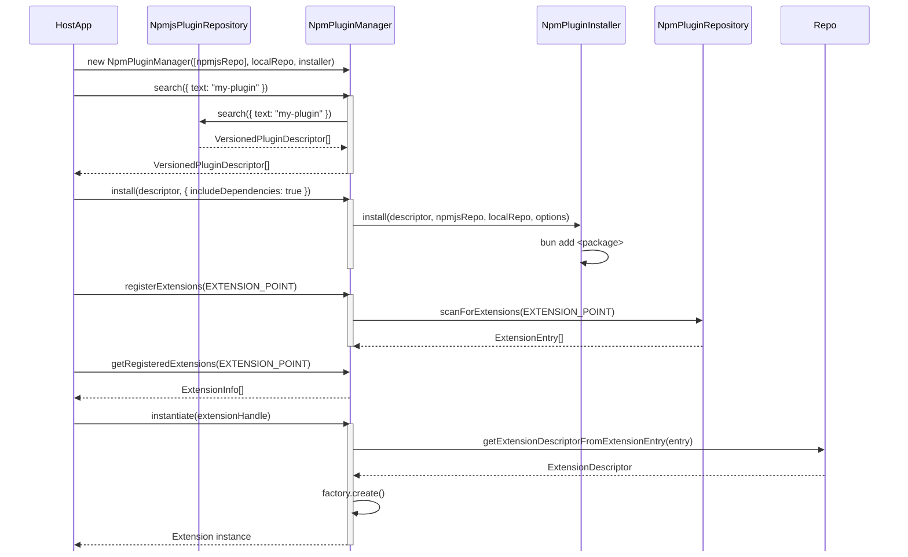

# Implementation Details

The package provides two entry points depending on your role:

**Plugin authors** only need the plugin-side interfaces. Import from the
`/plugin` subpath to keep the host implementation out of your module graph. For example:

```typescript
import type {
  Plugin,
  ExtensionDescriptor,
  ExtensionFactory,
  PluginDependency,
  VersionedPlugin,
} from "@flowscripter/dynamic-plugin-framework/plugin";
```

**Host application authors** import from the main entry point, which exposes
the full API including concrete implementations. For example:

```typescript
import {
  DefaultPluginManager,
  NpmjsPluginRepository,
  NpmPluginInstaller,
  NpmPluginRepository,
} from "@flowscripter/dynamic-plugin-framework";
import type { ExtensionInfo, PluginManager } from "@flowscripter/dynamic-plugin-framework";
```

## Plugin API

The following diagram provides an overview of the `Plugin` API:



A `VersionedPlugin` extends `Plugin` with metadata that can be used by versioned repositories and installers without loading the plugin module:



## PluginRepository API

The framework provides a hierarchy of `PluginRepository` interfaces. The base interface is extended by `VersionedPluginRepository` (for repos with version metadata in a backing store) and further by `MarketplacePluginRepository` (for remote marketplaces):



## PluginInstaller API

`PluginInstaller` provides the base install/uninstall contract. `VersionedPluginInstaller` extends it with dependency-aware install, a dependent-safety guard on uninstall, and update checking:



## PluginManager API

`DefaultPluginManager` handles standard plugin discovery and instantiation. `MarketplacePluginManager` extends the `PluginManager` API with search and install, delegating standard manager methods to an internal `DefaultPluginManager` backed by the local repository:



## Plugin Discovery and Instantiation Flow

The following sequence diagram shows the flow for using `DefaultPluginManager` directly with a `UrlListPluginRepository`:



## Marketplace Plugin Discovery, Installation and Instantiation Flow

The following sequence diagram shows the flow for using `NpmPluginManager` to search, install, and instantiate plugins from the npm marketplace:


