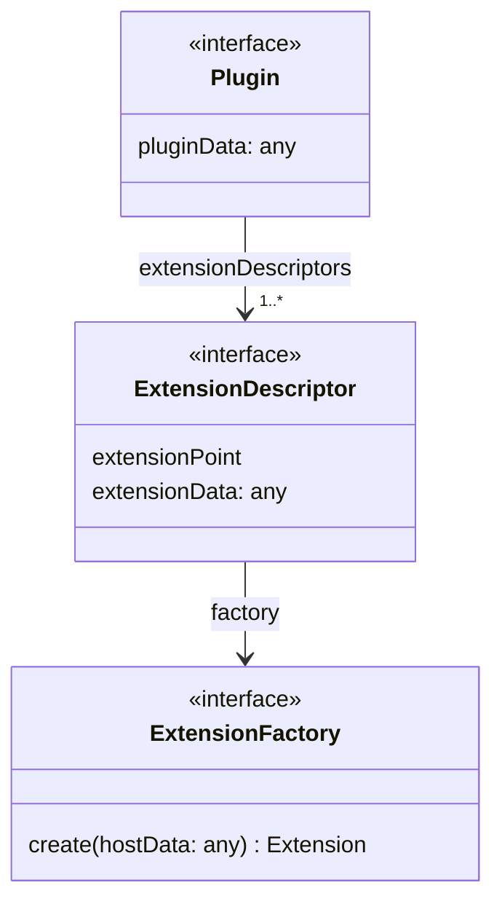
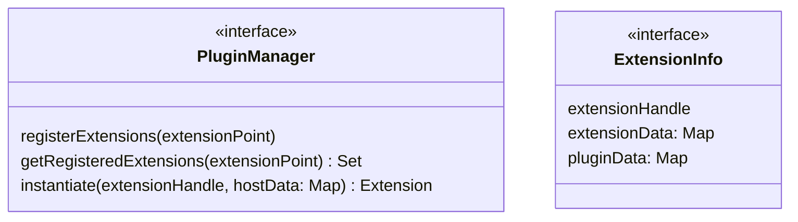

# Implementation Details

The package provides two entry points depending on your role:

**Plugin authors** only need the three plugin-side interfaces. Import from the
`/plugin` subpath to keep the host implementation out of your module graph:

```typescript
import type {
  Plugin,
  ExtensionDescriptor,
  ExtensionFactory,
} from "@flowscripter/dynamic-plugin-framework/plugin";
```

**Host application authors** import from the main entry point, which exposes
the full API including concrete implementations:

```typescript
import {
  DefaultPluginManager,
  UrlListPluginRepository,
} from "@flowscripter/dynamic-plugin-framework";
import type { ExtensionInfo, PluginManager } from "@flowscripter/dynamic-plugin-framework";
```

## API

The following diagram provides an overview of the `Plugin` API:



The following diagram provides an overview of the `PluginManager` API:


