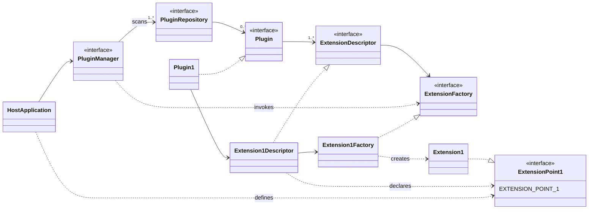
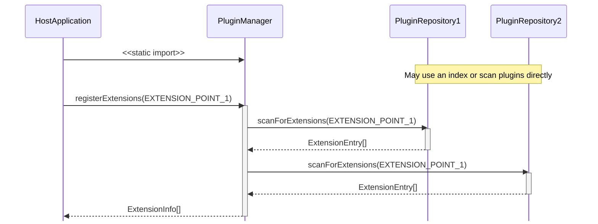
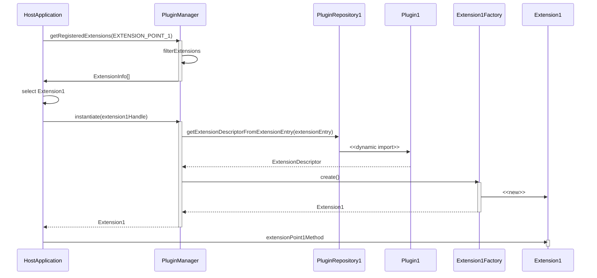
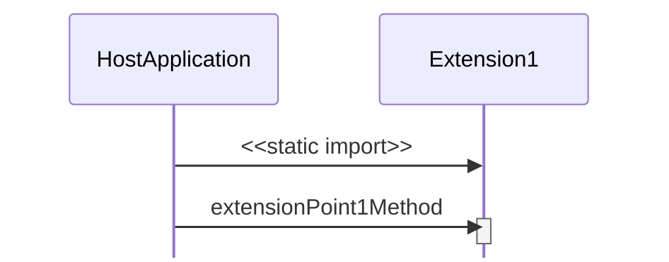

# Key Concepts

The framework's key concepts are borrowed from the Eclipse Project's extension
framework. The key concepts are:

- A `Plugin` provides one or more `Extension` implementations.
- Each `Extension` implementation declares an `ExtensionPoint` identifier and an
  `ExtensionFactory` via an `ExtensionDescriptor`.
- A `HostApplication` instantiates a `PluginManager`.
- The `HostApplication` can register one or more `ExtensionPoint` identifiers
  that the `PluginManager` should be aware of.
- The `PluginManager` scans one or more `PluginRepository` implementations to
  find and register `Plugin` objects for any `ExtensionPoint` identifiers it is
  aware of.
- The `HostApplication` uses the `PluginManager` to query for and select an
  `Extension` for a desired `ExtensionPoint` identifier.
- The `PluginManager` uses the associated `ExtensionFactory` to instantiate the
  selected `Extension`.

The following high level class diagram illustrates these relationships:

The following sequence diagram illustrates the key steps for a `HostApplication`
to use a `PluginManager` for discovery and registration of `Plugin` instances:

Once registration has been performed, the `HostApplication` may query the
`PluginManager` for `Extensions` of known `ExtensionPoints` and then instantiate
them:

As `ExtensionPoints` are simply Typescript objects, for the purposes of testing
or validation, it is possible to bypass the framework altogether and import an
`Extension` and use it directly:

